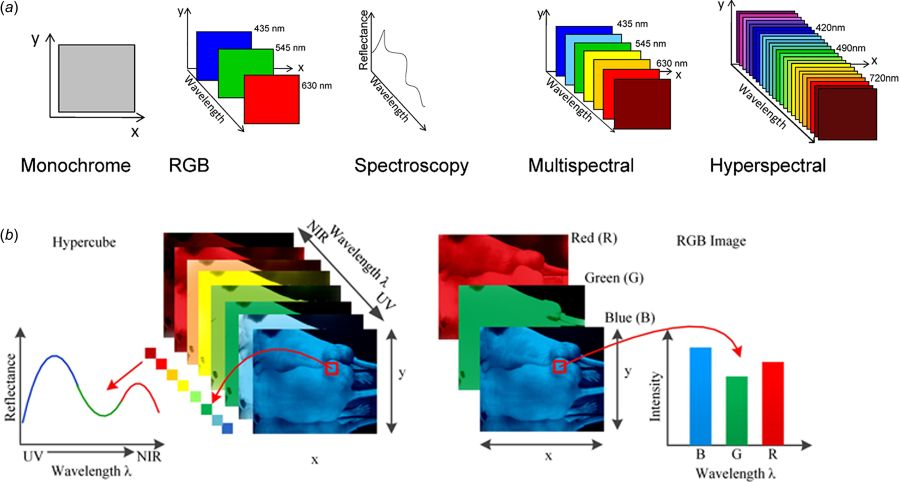
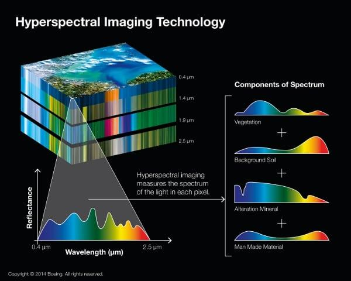

# GUI For Hyperspectral Image Preprocessing Using Python

## 1. Introduction

In layman’s language, remote recognizing is the checking of Earth by satel-
lite or high-flying workmanship so as to get data concerning it. It’s essentially
the investigation of getting data concerning articles or zones from a detachment,
sometimes from claim to fame or satellites.

Remote sensors collect learning by examination of the criticalness that is
reflected from the planet. These sensors are on the satellites or mounted on the
workmanship.

Remote sensors are either inactive or dynamic. Standoffish sensors answer to
outer redesigns. They record standard centrality that is reflected or discharged
from the Earth’s surface. The essential ordinary supply of radiation perceived
by inert sensors is reflected in the sunshine.

In a refinement, dynamic sensors utilize inward upgrades to gather getting
the hang of concerning Earth. For instance, an optical contraption shaft remote
distinctive structure comes a laser onto the outside of Earth and measures the
time that it takes for the laser to reflect back to its perceiving part.

## 2. Application of Remote Sensing

<b>Coastal applications:</b> Screen bound changes, track dregs transport guide
waterfront alternatives. This information is utilized for the seaside mapping
and disintegration block.

<b>Ocean applications:</b> Screen sea dissemination and the ebb and flow frame-
works, live sea temperature and wave statures and track sea ice. This learning
is won’t to higher see the seas and the best approach to best oversee sea assets.

<b>Hazard applications:</b> Tack hurricanes, earthquakes, erosion and flooding.
This knowledge is wont to assess the impacts of natural disaster and make readi-
ness ways to be used before and once a venturous event.

<b>Natural resource management:</b> Monitor land use, map wetlands, and
outline life circumstances. This information is wont to limit the insidiousness
that urban improvement has on the setting and bolster pick the most ideal ap-
proach to manage the guarantee run of the mill assets.

## 3. Formats Of This Hyperspectral Image

Multiband image data are represented by a combination of spatial position
(pixel number and line number) and band. The data format for remote sensing
images is classified into the following three types:

**BSQ:** Band SeQuential image data (pixel number and line number) of each band
are separately stored.

**BIL:** Band Interleaved by Line data are arranged in the order of band number
and repeated with respect to the line number.

**BIP:** Band Interleaved by Pixel data with respect to each pixel arranged spa-
tially by pixel number and line number.

For shading picture yield, BSQ organization would be helpful on the grounds
that three groups will be doled out to R, G and B. Anyway BIP arrangement
would be better for characterization by most extreme probability classifier in
light of the fact that multi-band information are required pixel by pixel for the
multi-variable handling. BIL would be a trade off among BSQ and BIP.

Remote detecting data some of the time incorporates various explanation
information also to picture information. So the satellite picture information
have been given in a standard organization called World Standard Format (as
a rule utilizes BSQ or BIL format), or LTWG position (indicated via Landsat
Technical Working Group).

## 4. Reflectance Value of Hyperspectral Images

Each non-living or living body reflects also ingests transmissions by numer-
ous sources. Presently the satellites transmit flag which is pondered by items
Earth. Each material assimilates an alternate measure of transmissions and re-
flects an alternate measure of transmissions.

The reflected flag figures out which object is there and stores the reflectance
esteems. There are 425 groups which store distinctive snippets of data of a
pixel and has diverse reflectance esteems for various wavelengths. By plotting
of reflectance esteems versus wavelengths chart we can realize which object it is
and furthermore the qualities of that object.

## 5. Classification of Reflectance Values

The classification of the objects can be done on the basis of wavelengths.
Few examples are given below.

**Vegetation:** Chlorophyll being green acclimatizes light at wavelength around 0.45m
(blue) and 0.67m (red) and reflect immovably in green light, in this man-
ner our eyes see strong vegetation as green. Strong plants have a high
reflectance in close infrared some place in the scope of 0.7m and 1.3m.
This is fundamentally a result of the inside structure of plant leaves. As
the inside structure of leaves varies from plant to plant. This urges us to
understand which plant is there.

**Water:** In the liquid state, water has commonly low reflectance, with clear wa-
ter having the best reflectance in the blue portion of the unmistakable
piece of the range. Water has high absorption and no reflectance in the
nearby infrared wavelengths extend.Turbid water has high reflectance in
evident district than clear water. This is moreover substantial for wa-
ters containing vegetation. Ice and snow all things considered have high
reflectance over each perceptible wavelength. Reflectance reduces in the
nearby infrared section and there is low reflectance in shortwave infrared.

**Soil:** Exposed soil, for the most part, has to expand reflectance, with more
noteworthy reflectance in close infrared and shortwave infrared. A few
variables influencing the reflectance are:

- **Moisture Content**

- **Soil Texture**

- **Surface Roughness**

- **Presence of FeO 2 and Fe 2 O 3**

- **Moisture Content**

## 6. GUI Usage

The GUI, presented above is made in python using Tkinter library. This
library contains functions like Button, Menu, Canvas, Frame, etcetera. I also
used classes like filedialog. This class contains functions used to open a dialog
box to navigate hrough computer drives and select the file.

Here I first created a frame in which we will be making other features like
buttons or menu or even loading the photo. After that I created a navigation
menu bar which contains options like File and Edit which contains options like:

- **File: ”Open”, ”Save”, ”Exit”**

- **Edit: ”Bands”**

- **Quit: ”Quit”**

#### 6.1 File

The Open option will open a dialog box which will be used to select the
.ENVI file which then will be used to load the hyperspectral image. The Save
option will save the current modified image as .ENVI file or any other as per
users choice. The Exit option will close the window and the program will shut
down.

The Open option opens a dialog box and allows us to select the image to
open. For this I used the spectral library of python from which I used io class
and envi function.

#### 6.2 Edit

The ”Edit” menu contains ”Bands” option which will open a window in
which the user have to enter 3 values i.e the bands which will show the image
in having the entered bands.

#### 6.3 Graph

The graph in one the image above is created by Spectral library. This
library has an in-built function that will show the graph of reflectance values
vs wavelength. This graph gives us the information of the object present in the
pixel selected.

#### 6.4 Preprocessing

The bands having negative values are not used and so we need to remove it.
For that I used a library called Hyspeclib. This library gives eigenvavlues and
minimum and maximum reflectance values so that we can remove the negative
values. Usually the negative values are -9999 and so it is easy to know them
and remove them.

After their removal, the image is saved in two parts where the original image
is stored and then the saved image is opened. This image does not contain
reflectance values that are negative.

## 7. References

- https://www.rsipvision.com/image-processing-for-precise-agriculture/

- https://dialnet.unitioja.es/descarga/articulo/5178334.pdf

- http://gsp.humboldt.edu/OLM/Courses/GSP_216_Online/lesson2-1/reflectance.html

- http://www.spectralpython.net/

- https://github.com/hetul-patel/hyspeclib

## 8. Acknowledgement

I would like to express my deepest appreciation to all those who provided me
with the possibility to complete this project. I acknowledge with thanks, the
support rendered by Prof. Tarjani Vyas and Junior Research fellow Kinjal
Dave, under whose support I was able to complete the task in a given period
of time. I also appreciate the constructive suggestions given by my friends to
further enhance the content of the project and report. At the home front, I am extremely
grateful to my family members for the support and encouragement I got from
them in successfully completing the project.

## 9. To-Do

- [ ] Identifying the region based on reflectance value.
- [ ] Using clustering algorithms to predict the region.
- [ ] Format the code to a more readable format.
